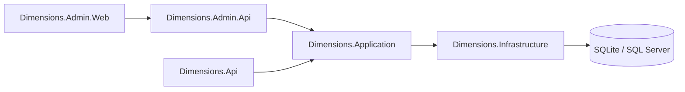

# Dimensions 文件總索引

## 目的

這份文件用來說明：

- 正式文件的閱讀順序
- 實作時的開發順序
- 目前專案的核心架構決策

## 文件分類原則

- `docs/`
  - 放正式規格、架構、API、資料庫、套件等說明文件
- `planning/`
  - 放開發中的待辦、追蹤、工作筆記

簡單說：

- `docs` 是「這個系統怎麼設計」
- `planning` 是「接下來先做什麼」

## 文件格式規範

為了避免文件、畫面文案或 API 使用過程出現亂碼，請統一遵守：

- 所有 `Markdown`、`cshtml`、`json`、`cs`、`ps1` 等文字檔都使用 `UTF-8`
- 若編輯器可選，建議使用 `UTF-8` 或 `UTF-8 with BOM`
- 不要混用 Big5、ANSI 或其他本機編碼
- 若文件流程較複雜，可加入 `Mermaid` 流程圖輔助說明

簡單原則：

- 文字以台灣繁體中文為主
- 圖示用 `Mermaid`
- 需要快速理解的地方，優先用「短段落 + 圖」說明

## 建議先看哪幾份

如果你是第一次接觸這個專案，建議先讀這 3 份：

1. [01_webapi_architecture_with_optional_admin_ui.md](01_webapi_architecture_with_optional_admin_ui.md)
2. [02_dotnet_webapi_architecture_spec.md](02_dotnet_webapi_architecture_spec.md)
3. [09_project_structure_guide.md](09_project_structure_guide.md)

這樣可以先理解：

- 專案為什麼要這樣切
- 每個 project 的責任是什麼
- 目錄上的檔案應該放在哪裡
- 實際開發時要先改哪裡、怎麼跑起來

建議閱讀時可這樣理解：

- `01` 先看整體架構方向與核心邊界
- `02` 再看 project 責任、依賴方向與落地規格

## 建議閱讀順序

新加入專案的人，建議照下面順序閱讀：

1. [01_webapi_architecture_with_optional_admin_ui.md](01_webapi_architecture_with_optional_admin_ui.md)
2. [02_dotnet_webapi_architecture_spec.md](02_dotnet_webapi_architecture_spec.md)
3. [03_api_jwt_endpoint_spec.md](03_api_jwt_endpoint_spec.md)
4. [04_sqlserver_jwt_api_schema.md](04_sqlserver_jwt_api_schema.md)
5. [06_sqlserver_seeddata_spec.md](06_sqlserver_seeddata_spec.md)
6. [05_sqlserver_seed_insert.md](05_sqlserver_seed_insert.md)
7. [07_dimensions_nuget_packages.md](07_dimensions_nuget_packages.md)
8. [08_admin_web_implementation_spec.md](08_admin_web_implementation_spec.md)
9. [09_project_structure_guide.md](09_project_structure_guide.md)
10. [10_api_development_guide.md](10_api_development_guide.md)

## 為什麼這樣排

這個順序是從「概念」一路走到「可實作」：

1. 先看大方向
2. 再看 solution 與 project 怎麼切
3. 再看 API 與 JWT 規則
4. 再看資料表
5. 再看 seed 規格與測試情境
6. 最後看可執行 SQL 與套件清單
7. 再用專案與目錄說明，理解實際檔案應放哪裡

對新手來說比較不容易迷路。

## 建議開發順序

實作時建議照這個順序進行：

1. 架構邊界
2. solution / project 切分
3. API 與 JWT 規則
4. 資料表 schema
5. seed 規格與測試情境
6. seed SQL
7. NuGet 套件同步
8. Admin Web

對應的待辦入口請看：

- [planning/README.md](../planning/README.md)

## 目前已定案的核心方向

### API 邊界

- `Dimensions.Api`
  - 只提供業務 API
  - 不提供 login API
  - 只驗 token，不簽發 token

- `Dimensions.Admin.Api`
  - 提供管理員登入
  - 管理 token
  - 管理 device
  - 提供管理查詢與稽核相關 API

- `Dimensions.Admin.Web`
  - 採用 ASP.NET Core MVC
  - 呼叫 `Dimensions.Admin.Api`

### 共用層

目前先共用以下 project：

- `Dimensions.Application`
- `Dimensions.Domain`
- `Dimensions.Infrastructure`
- `Dimensions.Contracts`

目前先不再細拆 token management 專用的 application / domain project。

## 給新手的快速理解

如果你剛加入專案，可以先記住一句話：

- `Admin` 這邊負責「登入、發 token、管 token」
- `Api` 這邊負責「收 token、驗 token、執行業務」

如果你看完前面幾份文件，還是不確定檔案該放哪裡，請接著看：

- [09_project_structure_guide.md](09_project_structure_guide.md)

如果你已經準備開始改 code，請再接著看：

- [10_api_development_guide.md](10_api_development_guide.md)

這樣看後面的文件會快很多。

## 備註

- 舊的 `docs/v1_1/` 可視為前一版素材
- 新的正式文件以 `docs/` 根目錄為主
- 開發待辦請看 [planning/README.md](../planning/README.md)
