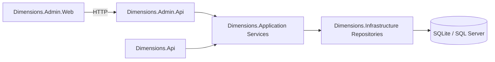
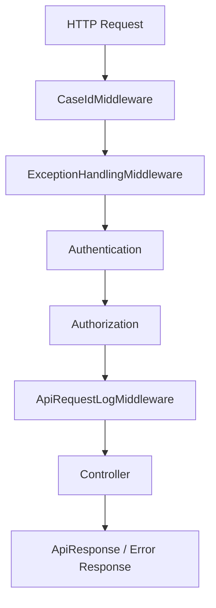

# .NET WebAPI 架構規格

## 目的

這份文件定義 `Dimensions` solution 的 project 切分、責任分配，以及 API host 的基本執行方式。

## 架構原則

本專案採用可重用、可擴充、可逐步重構的分層架構。
設計目標是讓系統能夠快速導入新專案，並在後續功能擴充時維持清楚邊界與穩定依賴。

### 1. 平台能力優先穩定

系統應優先建立並穩定可重用的共用能力，再逐步擴充業務模組。

平台共用能力包含：

- 驗證
- 驗章與授權
- 統一回應格式
- 例外處理
- logging
- pagination
- options / configuration
- 開發與測試基礎工具

平台能力應盡量保持獨立，不與特定業務邏輯緊耦合。

### 2. 業務模組各自獨立成長

業務功能應依模組邊界獨立演進，避免不同功能彼此交錯、相互牽制。

例如：

- `Customer` 屬於業務模組
- `TokenManagement` 屬於管理模組
- `Logging` 屬於平台模組

不同性質的模組應依責任分離，不混用相同 service 或流程。

### 3. 新功能以新增為優先

新增功能時，應優先透過新增檔案與新增模組的方式完成，而不是大量修改既有核心檔案。

常見新增項目包含：

- request / response
- validator
- service
- repository
- endpoint

此原則有助於降低舊功能受影響的風險，並提升整體可組裝性。

### 4. 依賴方向固定

系統依賴方向應維持單向，避免反向依賴造成結構混亂。

依賴方向如下：

- `Web/API -> Application`
- `Application -> Domain / Contracts`
- `Infrastructure` 實作 `Application` 定義的介面

原則上：

- API 層不直接依賴 Infrastructure 細節
- Application 層不依賴 Web 層
- Domain 層不依賴外部框架或資料來源實作

### 5. 管理與業務永遠分流

管理功能與業務功能必須分開設計與演進，避免邊界混淆。

系統分工如下：

- `Dimensions.Api`：提供業務 API
- `Dimensions.Admin.Api`：提供管理 API
- `Dimensions.Admin.Web`：提供管理畫面

管理流程不得回流到業務 API，業務模組也不應承擔管理責任。

### 6. 契約優先穩定

`Contracts` 層應作為系統跨層與對外溝通的穩定契約，保持清楚、低耦合、易重用。

`Contracts` 建議包含：

- request / response model
- DTO
- 統一回應模型
- 分頁模型
- 共用錯誤模型

`Contracts` 不應包含：

- 資料庫細節
- SQL 結構
- Infrastructure 實作邏輯
- 特定框架綁定內容

## Solution 結構

```text
Dimensions.sln
src/
  Dimensions.Api
  Dimensions.Admin.Api
  Dimensions.Admin.Web
  Dimensions.Application
  Dimensions.Domain
  Dimensions.Infrastructure
  Dimensions.Contracts
tests/
  Dimensions.Api.Tests
  Dimensions.Admin.Api.Tests
  Dimensions.Application.Tests
```

## 整體呼叫關係



## 各 project 職責

### 1. Dimensions.Api

負責：

- 業務 API controller
- 業務 token 的 JWT 驗證
- 業務 API authorization policy
- middleware、filter、Swagger、logging

常見 controller：

- `CustomerController`
- 未來的 `OrderController`
- 未來的 `AccountController`

不負責：

- 管理員登入
- `TokenController`
- `DeviceController`

### 2. Dimensions.Admin.Api

負責：

- 管理員登入
- 取得目前登入管理員資訊
- token 管理 API
- device 管理 API
- 管理查詢與稽核 API

常見 controller：

- `AuthController`
- `TokenController`
- `DeviceController`

### 3. Dimensions.Admin.Web

負責：

- ASP.NET Core MVC 管理前端
- 頁面流程
- 表單提交
- 管理操作畫面
- 呼叫 `Dimensions.Admin.Api`

### 4. Dimensions.Application

負責：

- use case / service orchestration
- 應用層規則
- repository 介面
- current user / caseId 抽象

常見 service：

- `AuthService`
- `TokenService`
- `DeviceService`
- `TokenUsageLogService`

### 5. Dimensions.Domain

負責：

- enum
- constants
- domain rule
- 共用語意模型

重要 enum：

- `TokenType`
- `TokenStatus`

### 6. Dimensions.Infrastructure

負責：

- Dapper / SQL 存取
- SQLite / SQL Server provider
- repository implementation
- logging persistence
- security / time helper

### 7. Dimensions.Contracts

負責：

- request DTO
- response DTO
- shared response model
- paging model

重要共用模型：

- `ApiResponse<T>`
- `ApiErrorData`
- `PagedResult<T>`

## 模組切分策略

為了讓系統具備可移植性、可擴充性與可重構性，功能切分應以「平台模組、管理模組、業務模組」三種類型為主。

### 1. 平台模組

平台模組是大多數專案都可重用的基礎能力，應優先穩定，不應與特定業務綁定。

常見平台模組包含：

- Authentication
- Authorization / Policy
- Validation
- ApiResponse / ErrorCode
- Middleware
- Logging
- Pagination
- Options / Configuration
- Common utilities

這類能力通常由 `Dimensions.Api` 與 `Dimensions.Admin.Api` 共用，主要實作會落在：

- `Dimensions.Application`
- `Dimensions.Domain`
- `Dimensions.Infrastructure`
- `Dimensions.Contracts`

### 2. 管理模組

管理模組屬於後台功能，應集中在 `Dimensions.Admin.Api` 與 `Dimensions.Admin.Web`，不得混入業務 API。

目前管理模組包含：

- `AdminAuth`
- `TokenManagement`
- `DeviceManagement`
- `LogQuery`

原則上：

- `Admin.Web` 只透過 `Admin.Api` 呼叫
- 管理流程不回流到 `Dimensions.Api`
- 管理模組的變更不應影響業務 API 的入口設計

### 3. 業務模組

業務模組是系統實際提供價值的功能，應依功能邊界獨立演進。

目前已存在的業務模組：

- `Customer`

未來可持續擴充：

- `Order`
- `Account`
- `Report`
- `Integration`

每個業務模組建議盡量擁有自己的：

- request / response
- validator
- service
- repository
- endpoint

理想情況下，新增一個業務模組應以新增檔案為主，而不是大幅修改既有平台層或其他業務模組。

### 4. 資料存取模組

資料存取屬於 Infrastructure 的責任，不應成為業務邏輯的核心。

建議原則：

- repository 介面定義於 `Application`
- repository 實作放在 `Infrastructure`
- 資料來源切換邏輯集中於 `Infrastructure`

這樣可讓上層 service 不需要關心底層是：

- SQLite
- SQL Server
- 其他資料來源

### 5. 模組新增判準

當新功能加入時，可用以下方式判斷是否符合目前架構方向：

1. 這是平台能力、管理模組，還是業務模組
2. 這次新增是否以新增檔案為主
3. 是否維持既有依賴方向
4. 是否把管理功能混入業務 API
5. 是否讓既有模組承擔了不屬於它的責任

## API Host 執行方式

### 共用 pipeline 方向

`Dimensions.Api` 與 `Dimensions.Admin.Api` 應採相同的基本平台風格：

1. `CaseIdMiddleware`
2. `ExceptionHandlingMiddleware`
3. Authentication
4. Authorization
5. Request logging
6. Controllers



### 回應格式責任

成功回應：

- 由 controller 回傳 `ApiResponse<T>`

失敗回應：

- 由 `ExceptionHandlingMiddleware` 處理
- 由 validation filter 處理 request validation failure

不使用：

- `UnifiedResponseFilter`

## Policy 模型

### Admin API

- `AdminOnly`
- `TokenManage`

### 業務 API

- `AuthenticatedUser`
- `CustomerQuery`
- 未來可擴充 `Scope:{scope}` 或 `ModuleAccess:{module}`

## Token 類型使用規則

### Dimensions.Admin.Api

接受：

- `AdminSession`

### Dimensions.Api

接受：

- `UserAccess`
- `Integration`
- `Service`

拒絕：

- `AdminSession`

## Logging

目前標準：

- 使用 ASP.NET Core `ILogger<T>`
- 使用 `log4net` 作為本機檔案 logging provider
- `ApiRequestLogMiddleware` 目前已會將基本 request 資訊寫入 DB
- `ApiRequestLogMiddleware` 第一版也會將 `application/json` 與 `text/*` 的 request / response payload 寫入 DB
- `ExceptionHandlingMiddleware` 目前已會將例外基本資訊寫入 DB
- payload log 目前會遮罩 `password / accessToken / refreshToken / authorization`
- `TokenUsageLogService` 目前只負責 token usage log，不等同完整 API logging service

之後 `Dimensions.Api` 與 `Dimensions.Admin.Api` 都應遵循相同方向。

## 設定檔方向

### Dimensions.Api

包含：

- 業務 API JWT 驗證設定
- DB connection
- logging

### Dimensions.Admin.Api

包含：

- 管理員登入相關設定
- token management 設定
- DB connection
- logging

### Dimensions.Admin.Web

包含：

- Admin API base URL
- MVC app 設定
- 必要的 session / UI 設定

## 對新手的補充說明

### 為什麼要拆成 `Api` 與 `Admin.Api`

因為兩者雖然共用底層邏輯，但入口責任不同：

- `Dimensions.Api`
  - 是給外部或前端呼叫的業務 API
- `Dimensions.Admin.Api`
  - 是給管理端用的後台 API

這樣拆之後：

- 安全邊界更清楚
- Swagger 更清楚
- controller 責任更明確
- 後續部署也更有彈性

### 為什麼共用層先不再細拆

因為目前最有價值的是「入口分清楚」，不是「底層拆很多 project」。

對新手來說，這樣也比較容易理解：

- 先看入口
- 再看共用 service
- 最後看 repository
