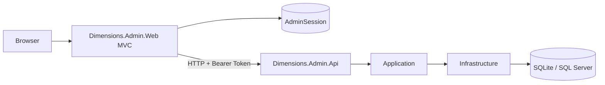
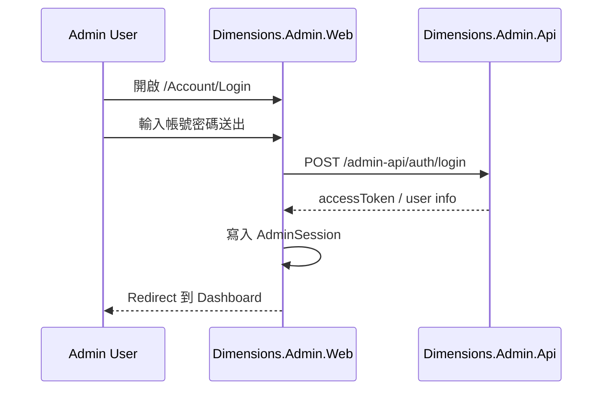

# Admin Web 實作規格

## 目標

`Dimensions.Admin.Web` 是管理後台前端，採用 ASP.NET Core MVC，負責提供管理員操作畫面。

目前主要涵蓋：
- 管理員登入
- Token 管理
- Device 管理
- Request / Exception Log 查詢

## 技術選型

- 專案名稱：`Dimensions.Admin.Web`
- 前端技術：`ASP.NET Core MVC`
- API 來源：`Dimensions.Admin.Api`
- Session 策略：登入後以 Session 保存管理員工作階段

## 專案依賴方向

```text
Dimensions.Admin.Web
  -> Dimensions.Contracts
  -> Dimensions.Admin.Api (透過 HTTP 呼叫)
```



設計原則：
- `Admin.Web` 不直接連資料庫
- `Admin.Web` 不直接呼叫 `Dimensions.Api`
- 所有管理功能都透過 `Dimensions.Admin.Api`

## 第一版 MVP 範圍

### 1. 登入流程

已完成：
- `/Account/Login`
- 串接 `POST /admin-api/auth/login`
- 建立 `AdminSession`
- 登出後清除 Session



### 2. Dashboard 首頁

已完成：
- `/`
- 顯示目前登入管理員資訊
- 顯示快速入口與主要管理功能

### 3. Token 管理

已完成：
- `/Tokens`
- `/Tokens/Create`
- `/tokens/{tokenId}`
- 撤銷 Token
- 補發 Token
- 續期 Token

### 4. Device 管理

已完成：
- `/Devices`
- `/Devices/Create`
- 停用 Device

### 5. Log 查詢

已完成：
- `/Logs/Requests`
- `/Logs/Exceptions`

### 6. 共用 UI 元件

已完成：
- `PageIntro`
- `SearchPanel`
- `DataTable`
- `ErrorAlert`
- `EmptyState`
- `LoadingOverlay`
- `ConfirmDialog`

這些 partial 用來統一 Token、Device、Log 頁面的查詢與清單呈現，讓後續新增畫面時可以直接沿用。

## Session 策略

- `AdminSession` 僅存在於 `Dimensions.Admin.Web`
- Web 端會把 `accessToken` 保存在伺服器端 Session
- 呼叫 `Dimensions.Admin.Api` 時，自動帶入 Bearer Token

## 錯誤處理

目前已完成的統一處理包含：
- 顯示 API 回傳的錯誤訊息
- 顯示錯誤碼與 `caseId`
- `401` 時清除 Session 並導回登入頁
- `403` 時導向 `Forbidden` 頁面
- 重要操作會先跳出確認對話框
- 表單送出期間會顯示全域 loading overlay

## 後續開發方向

建議依序補強：
1. 補更多頁面的文案與操作細節
2. Admin.Web 的 UI / integration tests
3. 視需要補 Token / Device 操作結果頁面摘要
